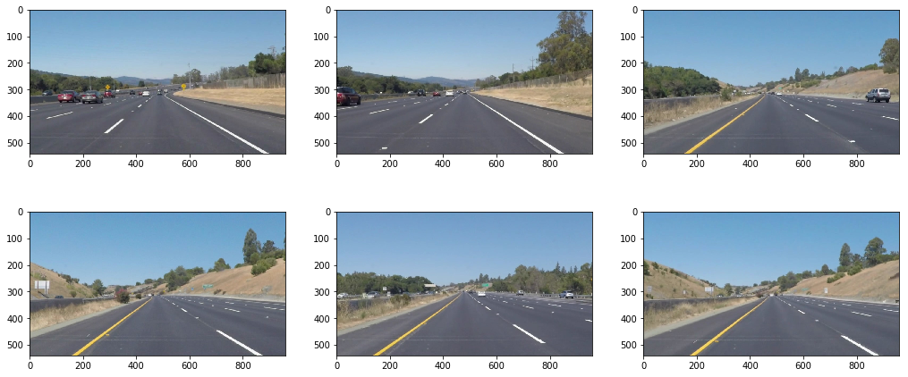
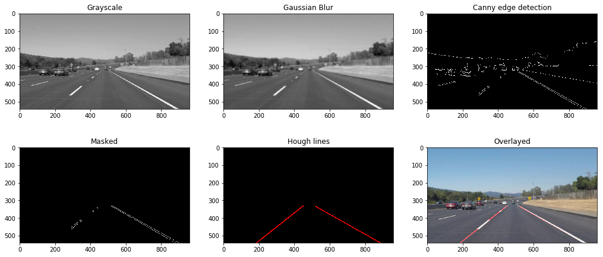

# Simple Lane Line Detection Project

The steps of this project are the following:
* Reduce the camera image to a binary image, from which lane lines can be detected
* Identify the lane lines in the binary image
* Compute the 1D polynomials that best fit each of the lane lines
* Draw the lane lines on the camera image
* Construct an image processing pipeline that can process a video stream

---

## Introduction
A simple lane detection algorithm is developed as an introduction to some basic image processing techniques and concepts. Most notably the use of OpenCV to process images and the notion of colour spaces, masking, edge detection and image space vs parameter (Hough) space.

The pipeline is first developed on a selection of still images.

## Processing Pipeline

My pipeline consists of 6 steps:
1. Conversion to grayscale
2. Gaussian blurring to reduce noise that could result in unwanted edges
3. Canny edge detection
4. Masking to leave only the edge-detected lane lines
5. Hough transformation to detect lines (drawn in red)
6. Overlaying the detected lines on the original image

### DrawLines class
The `DrawLines` class encapsulates all the functionality developed to perform lane line detection for this project. The class is callable, meaning that it can be called like a function, but then allows state saving between image frames when dealing with a video stream. The `__call__()` function implements the image processing pipeline, which shows the additional function calls for each of the main processing stages.  The class constructor takes a single parameter that sets the size of the buffer used for low-pass filtering.

The `draw_lines()` function draws lines using `(x1,y1)` and `(x2,y2)` coordinates provided by the `cv2.HoughLinesP()` function, populating independent arrays for each coordinate. To extrapolate separate lines for each of the left and right lane lines, the `draw_lines()` function differentiates between lanes on the left (negative slope) and lanes on the right (positive slope). Also, any lines outside of a suitable angle is discarded.

The averages of the `(x1,y1)` and `(x2,y2)` coordinates are taken, which can be then used with a polynomial fitting algorithm, `np.polyfit()`, to describe the line. The resulting parameters of the polynomial are used to draw out a single line from the bottom of the image up to a suitable distance - about halfway up the image, where the road disappears into the horizon.

To smooth out the lane detection for moving images, a second stage of averaging across multiple frames is computed using the `np.nanmean()` function. This is used as a low-pass filter, dampening spurious horizontal/vertical line detections.

## Processed images

## Processed video

## Reflection
### Shortcomings with the current pipeline

1. The masking stage is quite rudimentary as it blindly ignores data outside a static region of interest. As can be seen in the third, challenging test video, the region of interest may move in the image
2. Old, faded lane lines could confuse the algorithm
3. An overtaking car that veers into the lane infront may cause outliers to affect the running average and the overlayed lines will deviate from the lane lines

### Possible improvements to the current pipeline

1. Make the region of interest dynamically calculated - possibly by using data from additional sensors to determine where on the highway the car is
2. If a second, faded lane line is detected, a voting algorithm could determine which is the more likely correct lane line
